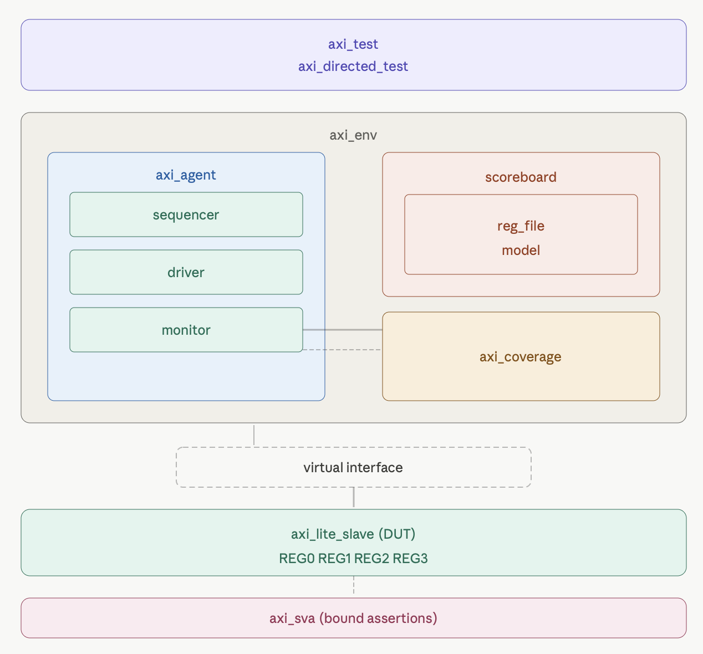

# AXI4-Lite Slave UVM Verification Environment

## 1. Project Overview       

A complete UVM-based verification enviroment for AXI4-Lite slave prepheral containing four 32-bit memory-mapped registers. this UVM enviroment contains  directed test suite and constraint random stimulis, self cheking scoreboard, protocol level SVA assertion and functional coverage.

**Simulator:** Synopsys VCS U-2023.03 / Cadence Xcelium 25.03  
**Methodology:** UVM 1.2  
**Language:** SystemVerilog

## 2. Architecture Diagram      


## DUT Register Map

| Offset | Register | Access | Description        |
|--------|----------|--------|--------------------|
| 0x00   | REG0     | R/W    | Control register   |
| 0x04   | REG1     | R/W    | Status register    |
| 0x08   | REG2     | R/W    | Data register      |
| 0x0C   | REG3     | R/W    | Scratch register   |

**Address decoding:** word-aligned addresses only (bits[1:0] == 2'b00).
Unaligned or out-of-range addresses return SLVERR.

## 4. Verification Plan        
| Feature              | Method              | Status |
|----------------------|---------------------|--------|
| Write all registers  | Constrained-random  | ✅     |
| Read all registers   | Constrained-random  | ✅     |
| Data integrity       | Write-read-back seq | ✅     |
| Partial write (WSTRB)| Directed test T4    | ✅     |
| Invalid address      | Stress + directed   | ✅     |
| SLVERR response      | Scoreboard check    | ✅     |
| AWVALID stability    | SVA p_awvalid_stable| ✅     |
| BRESP stability      | SVA p_bresp_stable  | ✅     |
| Reset behavior       | Monitor reset guard | ✅     |

## 5. UVM Environment           
| Component          | Description                                      |
|--------------------|--------------------------------------------------|
| `axi_seq_item`     | Transaction: op, addr, wdata, wstrb, bresp, rresp|
| `axi_driver`       | Drives AW/W/B/AR/R channels with handshake FSM   |
| `axi_monitor`      | Samples completed transactions from interface    |
| `axi_scoreboard`   | Golden register model, checks data + responses   |
| `axi_coverage`     | Tracks op, address, strobe, response coverage    |
| `axi_agent`        | Bundles driver + monitor + sequencer             |
| `axi_env`          | Connects agent → scoreboard + coverage           |
## 6. Test Suite                ← what each test does
this envirompent contains 2 test random and direct tests.
in the random test we call different sequences:

### `axi_test` — Constrained Random
Runs 4 sequences targeting all registers and corner cases:

- **Write Seq:** Random writes to all 4 registers.

- **Read Seq:** Random read from all 4 registers.

- **Write-Read Seq:** using Writes then reads back to check the data integrity.

-  **Stress Seq:** Random mix + invalid addresses (SLVERR testing).
### `axi_directed_test` — Directed
5 targeted scenarios verifying specific requirements:
- **T1:** Write `0xFFFFFFFF` to all registers — read back
- **T2:** Write `0x00000000` to all registers — read back
- **T3:** Alternating `0xAAAAAAAA`/`0x55555555` — stuck bit detection
- **T4:** Byte strobe `wstrb=4'b0001` — partial write verification
- **T5:** Invalid address `0x1` — SLVERR response

## 7. SVA Protocol Assertions            

| Property           | Rule                                          |
|--------------------|-----------------------------------------------|
| `p_awvalid_stable` | AWVALID stays high until AWREADY              |
| `p_wvalid_stable`  | WVALID stays high until WREADY                |
| `p_arvalid_stable` | ARVALID stays high until ARREADY              |
| `p_bresp_stable`   | BRESP stable while BVALID high                |

SVA is bound to the DUT without modifying RTL using `bind`.
During stress testing, assertions correctly caught unaligned 
write addresses and triggered SLVERR responses.
## 8. Coverage Results          

### `axi_test` (constrained random)
| Coverpoint      | Coverage |
|-----------------|----------|
| Overall         | 100.00%  |
| cp_op           | 100.00%  |
| cp_awaddr       | 100.00%  |
| cp_araddr       | 100.00%  |
| cp_bresp        | 100.00%  |
| cp_rresp        | 100.00%  |
| wstrb           | 100.00%  |

### `axi_directed_test` (directed)
| Coverpoint      | Coverage |
|-----------------|----------|
| Overall         |  53.26%%  |
| cp_op           | 100.00%  |
| cp_awaddr       | 31.25%  |
| cp_araddr       | 25.00%  |
| cp_bresp        | 100.00%  |
| cp_rresp        | 50.00%  |
| wstrb           | 13.00%  |

Coverage is intentionally partial, already directed tests verify 
specific requirements, not coverage closure.
## 9. Key Learnings 
- **AXI handshake protocol:** VALID must stay asserted until 
  READY — enforced by SVA and verified by simulation

- **Byte-enable logic:** WSTRB allows partial register writes —
  scoreboard implements same byte-enable logic as RTL
- **Monitor timing:** Interface clock/reset must be plain logic 
  signals for reliable access from virtual interfaces in classes
- **Directed vs random:** Complementary approaches — random finds 
  unknown bugs, directed verifies known requirements
## 10. How to Run

### VCS (Synopsys)
```bash
cd sim
./run.sh                    # run both tests
./run.sh axi_test           # random test only  
./run.sh axi_direct_test    # directed test only
```

